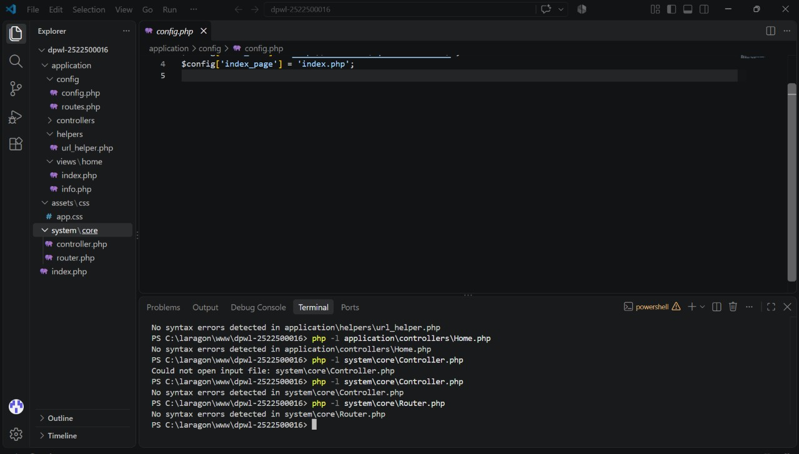
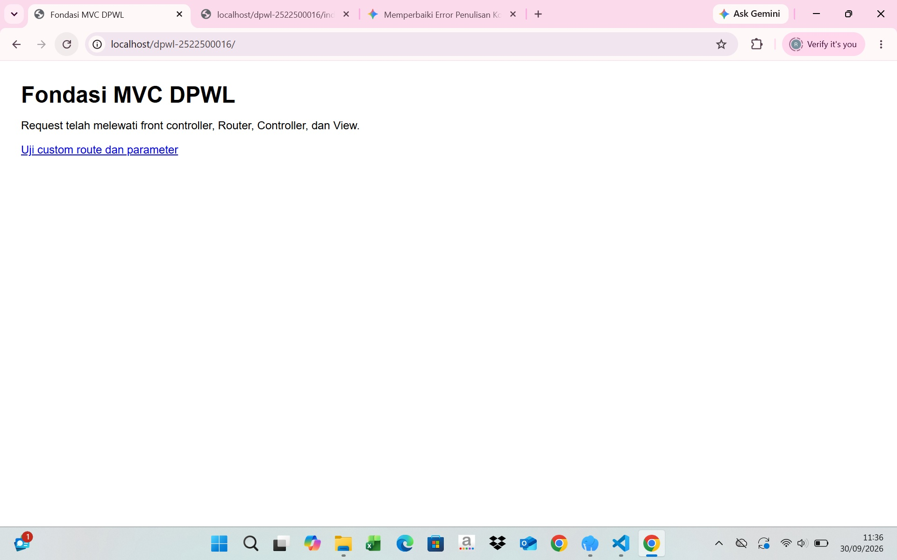
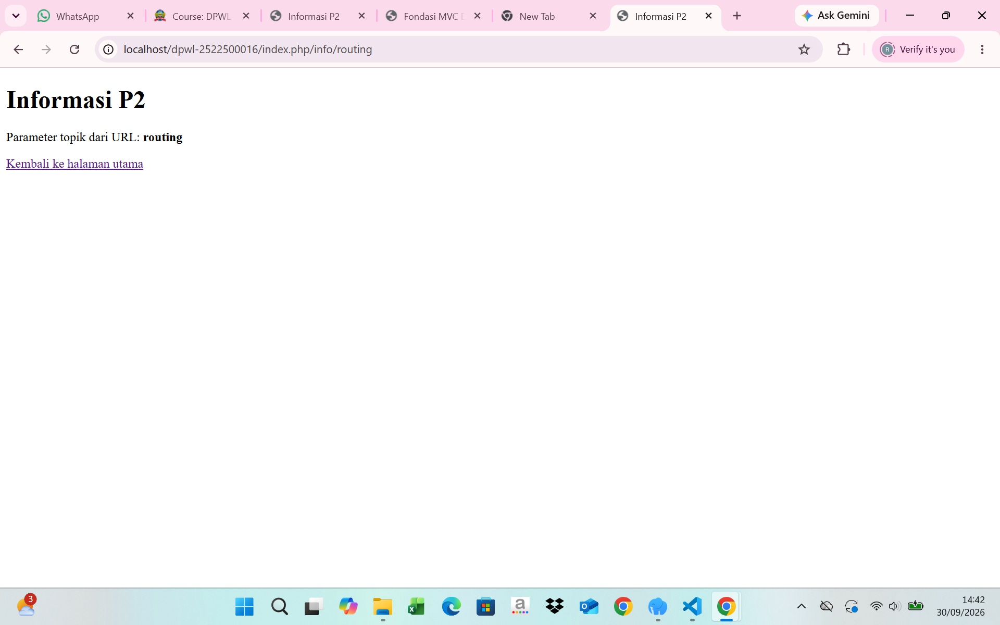

# pertemuan-02 
## 1. Tujuan Praktikum
tujuan pratikum kali ini adalah untuk memahami konsep dasar dari arsitektur MVC. dan saya belajar membuat satu titik masuk aplikasi lewat front controller, mengatur cara pemetaan URL , serta membuat fungsi helper untuk ULR dan aset. 
## 2. Struktur Direktori
[Tampilkan tree struktur P2 dan jelaskan fungsi setiap bagian.]

│   index.php
│   
├───application
│   ├───config
│   │       config.php
│   │       routes.php
│   │       
│   ├───controllers
│   │       home.php
│   │       
│   ├───helpers
│   │       url_helper.php
│   │       
│   └───views
│       └───home
│               index.php
│               info.php
│               
├───assets
│   └───css
│           app.css
│           
└───system
    └───core
            controller.php
            router.php

penjelasang fungsi = 
1. index.php = berperan sebagai front controller atau satu titik masuk utama untuk semua request aplikasi. 

2. application/config/ = berisi file konfigurasi aplikasi. 
- config.php = menyimpan konfigurasi URL dasar dan nama halaman utama 
- routes.php = menyimpan aturan pemetaan URL

3. application/controllers = berisi class controller aplikasi. 
- home.php = controller utama yang menangani request, mengolah logika aplikasi, dan memanggil view. 

4. application/views = tempat menyimpan file tampilan UI/HTML yang disajikan kepada pengguna. 
- home/index.php = tampilan untuk halaman utama aplikasi.
- home/info.php = tampilan untuk halaman informasi rute dan parameter.

5. assets/css/app.css = berkas css statis untuk mengatur gaya dan tata letak halaman.

6. sysetem/core = berisi komponen inti dari sistem MVC buatan sendiri. 
- controller.php = berperan sebagai base controller yang menyediakan fungsi pemanggilan view. 
- router.php = mesin router yang membaca URL,menerapkan aturan route, serta menentukan controller,method,dan parameter yang akan dijalankan.

## 3. Front controller
[Jelaskan peran index.php sebagai satu titik masuk aplikasi]
index php pada root proyek menjadi satu titik masuk. berkas ini mendefinisikan path aplikasi, memuat konfigurasi,helpero | routing | home/info.php |,class inti,routes,kemudian menyerahkan request kepada router.

## 4. Routing dan Pemetaan URL
| URL/Route | Controller | Method | Parameter | View |
|---|---|---|---|---|
| / | Home | index | - | home/index.php |
| home/index | Home | index | - | home/index.php |
| home/info/mvc | Home | info | mvc | home/info.php |
| info/routing | Home | inf
Tambahkan satu baris untuk route hasil Tahap Modifikasi ATM yang dibuat berdasarkan objek atau konteks
| Buku/Pinjam/50 |  | Buku | Pinjam | Buku/pinjam.php |
aplikasi DPW, kemudian jelaskan pemetaan route → Controller → method → parameter → View.
1.route : ( buku/pinjam/99) 
pengguna mengklik tombol pinjam buku alamat url masuk ke front controler
2.controller 
router membaca segmen pertama url, yaitu buku, router secara otomatis memanggil class Buku.php 
3.method 
router membaca segmen kedua url, router mengeksekusi fungsi/method di dalam controller untuk menjalankan logika konfirmasi pinjaman.
4.parameter 
router menangkap seegmen ketiga url, angka 99 dikirm sebagai parameter ID buku kedalam method pinjam(id) untuk mengidentifikasi buku spesifik yang ingin dipinjam.
5. View
controller menyiapkan data buku ID 99, lalu memanggil fungsi render.
Angka 99 dikirim sebagai parameter ID buku ke dalam method pinjam untuk mengidentifikasi buku spesifik yang ingin dipinjam.

## 5. Base URL dan Helper
Jelaskan fungsi base_url() dan site_url(), kemudian berikan contoh penggunaannya pada implementasi P2:
- base_url() = berfungsi untuk menghasilkan url dasar yang menunjuk langsung ke direktori utama aplikasi atau direktori publik tempat menyimpan aset statis. contoh : localhost/dpwl-2522500016/assets/css/

- site_url() untuk membentuk URL navigasi/route aplikasi.fungsi ini secara otomatis menyertakan front controller di dalam jalurnya, sehingga setiap navigasi rute dapat ditangkap oleh index dan diproses oleh router. contoh localhost/dpwl-2522500016/index.php/info/routing

## 6. Alur Request-response
Jelaskan dua alur berikut:
1. Alur eksekusi aktual P2:
Browser → index.php → Router → Controller → View → Response.
pada alur p2, permintaan dari pengguna diproses tanpa melibatkan model : browser mengirimkan permintaan http > index.php menerima permintaan,menginisialisasi konstanta path memuat konfigurasi helper dan core class > router : memeriksa daftar rute mencocokan pola url , memetakan ke nama controller dan method , serta mengekstrak parameter. > controller : memproses pemanggilan method dan menyiapkan data yang akan ditampilkan > view : memuat berkas tampilan visual mengekstrak variabel data > response : menampilkan hasil render html lengkap ke layar browser penggguna.  
2. Posisi Model dalam arsitektur MVC lengkap:
Browser → index.php → Router → Controller → Model → basis data/data → Model → Controller → View →
Response.
Pada implementasi P2, Model belum digunakan karena akses dan pengelolaan basis data mulai
diimplementasikan pada P3.
pada arsitektur MVC yang utuh, terdapat tahap pengelolaan data : 
browser mengirimkan permintaan ke index > router : memetakan url dan meneruskan permintaan ke controller > controller memanggil model untuk meminta atau mengolah data > model : melakukan operasi ke basis data > basis data : mengembalikan data mentah kembali ke controller > controller meneruskan data yang sudah siap ke view > view menggabungkan data dengan template html > response dikirimkan kembali ke browser. 

## 7. Hasil Pengujian dan Debugging
### Gambar 1. hasil pengujian dan debugging
kode ini untuk membantu menemukan kesalahan sintaks.

hasil "no syntax errors detected" menunjukan bahwa berkas yang diperiksa tidak memiliki kesalahan sintaks PHP, pemeriksaan sintaks tidak membuktikan seluruh logika aplikasi benar.
## 8. Bukti Tangkapan Layar
Sisipkan gambar yang relevan dari folder dokumentasi/ dengan perintah:
### Gambar 1. Hasil Pengujian Halaman utama

### Gambar 2. Hasil Pengujian Custom Route

## 9. Kesimpulan P2
Jelaskan apa yang sudah dapat dilakukan kerangka MVC dan apa yang baru akan ditambahkan pada P3.
kerangka aplikasi telah berhasil membangun fondasi arsitektur MVC yang mencakup front controller , routing , base controller , controller aplikasi dan view, base url dan helper serta alur request - response tanpa database 
yang akan ditambahkan pada p3 adalah kerangka fondasi MVC ini tidak diganti dari awal melainkan dikembangkan secara kumulatif dengan menambahkan : komponen awal, koneksi basis data, dan fitur otentikasi & sesi 